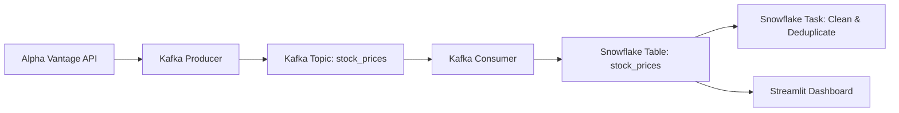

# 📈 Real-Time Stock Market Data Pipeline

A real-time data pipeline to ingest, process, and visualize live stock market data using **Kafka**, **Snowflake**, and **Streamlit**.

---

## ✨ Overview

This project simulates a real-world data engineering use case:

- Fetches real-time stock data from Alpha Vantage API.
- Streams the data into **Kafka** (via Docker).
- Consumes and stores data into **Snowflake** (cloud data warehouse).
- Cleans and transforms the data via SQL Tasks.
- Visualizes live prices in a **Streamlit Dashboard**.

---

## 🧱 Architecture



---

## 📊 Features

- ✅ **Real-Time Streaming** of stock data using Kafka.
- ✅ **ETL Pipeline** to load and transform data into Snowflake.
- ✅ **Cleaned Data Layer** using Snowflake SQL Tasks for deduplication and ordering.
- ✅ **Sentiment Analysis** from real-time news headlines using TextBlob and Yahoo Finance.
- ✅ **Forecasting Models**:
  - ETS (Exponential Smoothing)
  - ARIMA
- ✅ **Interactive Streamlit Dashboard** for:
  - Viewing real-time prices
  - Plotting individual stock trends
  - Analyzing sentiment of top headlines
  - Forecasting future stock prices
  ✅ Integrated an LLM
  

---

## 💪 Tech Stack

| Tool              | Purpose                            |
|-------------------|-------------------------------------|
| **Kafka**         | Real-time messaging & event stream  |
| **Snowflake**     | Cloud data warehouse                |
| **Streamlit**     | Real-time UI & visualization        |
| **Alpha Vantage** | Stock market data API               |
| **BeautifulSoup** | Web scraping Yahoo headlines        |
| **TextBlob + NLTK** | Sentiment analysis               |
| **ARIMA, ETS**    | Time-series forecasting models      |

---

## 🗅 Streamlit Dashboard Preview

- 📉 View and filter stock symbols
- 📰 Get live headlines with **sentiment insights**
- 📈 Forecast prices for next N days
- 🔍 Interactive charts with zoom & scroll

---

## 🔐 Setup & Run Instructions

1. **Clone the Repository**
   ```bash
   git clone https://github.com/your-username/real-time-stock-pipeline.git
   cd real-time-stock-pipeline
   ```

2. **Install Requirements**
   ```bash
   pip install -r requirements.txt
   ```

3. **Start Kafka (Docker Required)**
   ```bash
   docker-compose up -d
   ```

4. **Start the Producer**
   ```bash
   python kafka_producer.py
   ```

5. **Start the Consumer**
   ```bash
   python kafka_consumer.py
   ```

6. **Run the Streamlit Dashboard**
   ```bash
   streamlit run dashboard.py
   ```

---

## 📌 Notes

- Replace `YOUR_USER`, `YOUR_PASSWORD`, etc. in code files with your actual credentials 
- Kafka must be running before launching producer/consumer.
- You need a free Alpha Vantage API key: [Get it here](https://www.alphavantage.co/support/#api-key)

